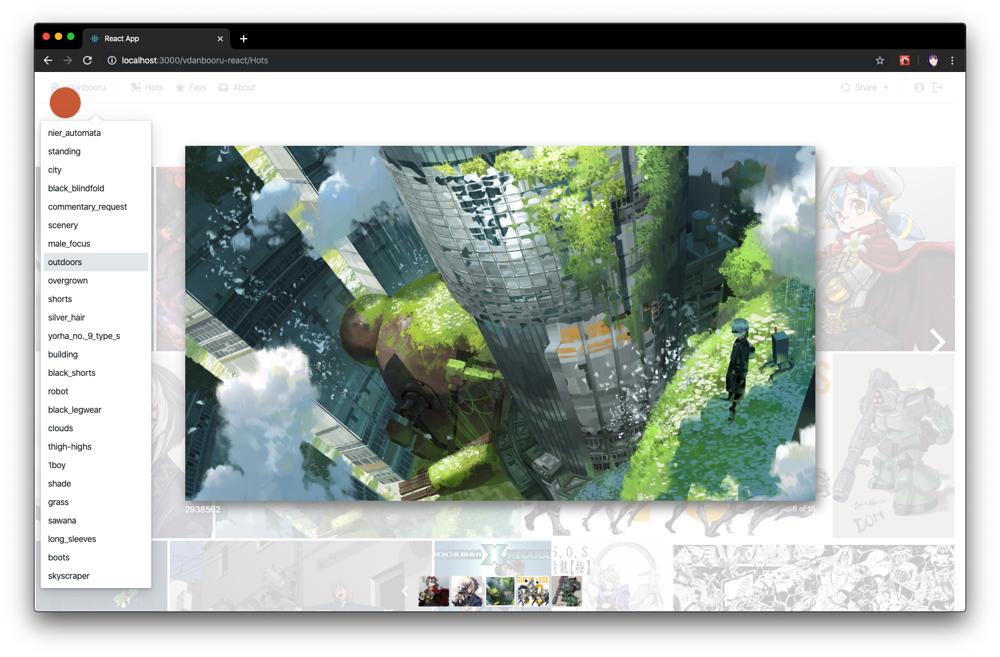
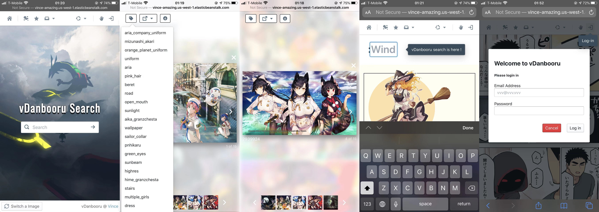

# vDanbooru React App

React & BlueprintJS implemented Anime Image search web application, using for searching Image from safe danbooru lib.

[vDanbooru React Portal](http://vince-amazing.com/vDanbooru-React-App)

_Index of vDanbooru_


_Search & Hots Page_


_Lightbox_


_Favorite Collection for Loginin Users_


_Sign-up & Login Support_


_Search by tags_


_Mobile_


### Update Logs

_12/07/2020_

* update dependencies

_12/12/2019_

* Fix mobile layout, and firebase warning
* Add Envorinment

_11/25/2019_

* Fix tag searching not working issue

_11/22/2019_

* Handle 'return' button action in searching page and minor codes tweaking

_11/06/2019_

* Improve gallery image load speed

_11/03/2019_

* Add blur effects to lightbox mode
* Fix popover position error
* Remove some of redundant code and improve code in module of tagPanel

_11/02/2019_

* Clean some of code in lightbox and popover effects
* Modularized Tag, download and share components across different parts
* Add indicator in Search page (can directly search in the head area of result page)
* Add switch background button
* Fix serval bugs

_10/31/2019_

* Add Redux Data Store
* Add favorite tab features for easy bookmarking
* Support new user to signup and login
* Add a connection to [Firebase](https://firebase.google.com/) authentication and Firestore database
* Now favorite images will be linked to your account
* Support tags search, and list tags in the results
* Fix bugs on both mobile and desktop

_10/30/2019_

* Add progress bar and non-ideal state
* Optimized for mobile devices
* Add share to social features, with [react-share](https://www.npmjs.com/package/react-share)

_10/27/2019_

* Init project with React & [BlueprintJS](https://blueprintjs.com/), ~~deployed with [ZEIT Now](zeit.co) and zero configuration~~
* Connect with api with backend Express with [booru](https://www.npmjs.com/package/booru), ~~[danbooru-node](https://www.npmjs.com/package/danbooru)~~
* Implement index, hot search page, with [react-grid-gallery](https://www.npmjs.com/package/react-grid-gallery)

### TODO

* [x] Add search features with tags
* [x] Add Favorite & share
* [x] Add login&signup Page
* [ ] Add favorite in search lightbox
* [ ] Pagination from Server side
* [ ] Multi-tag search support
* [ ] Chat / comment board
* [ ] ...

### Development & Build Instruction

``` bash
# 0. create your own .env file, referred from .env.sample

# 1. install dependencies
yarn

# 2. react start
yarn start

# 3. react build
yarn build

```

## LICENSE

MIT @ [Vince](//vince-amazing.com)
