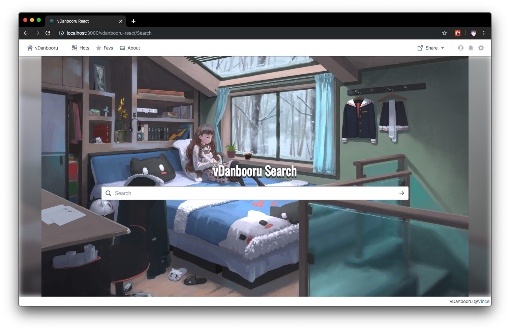
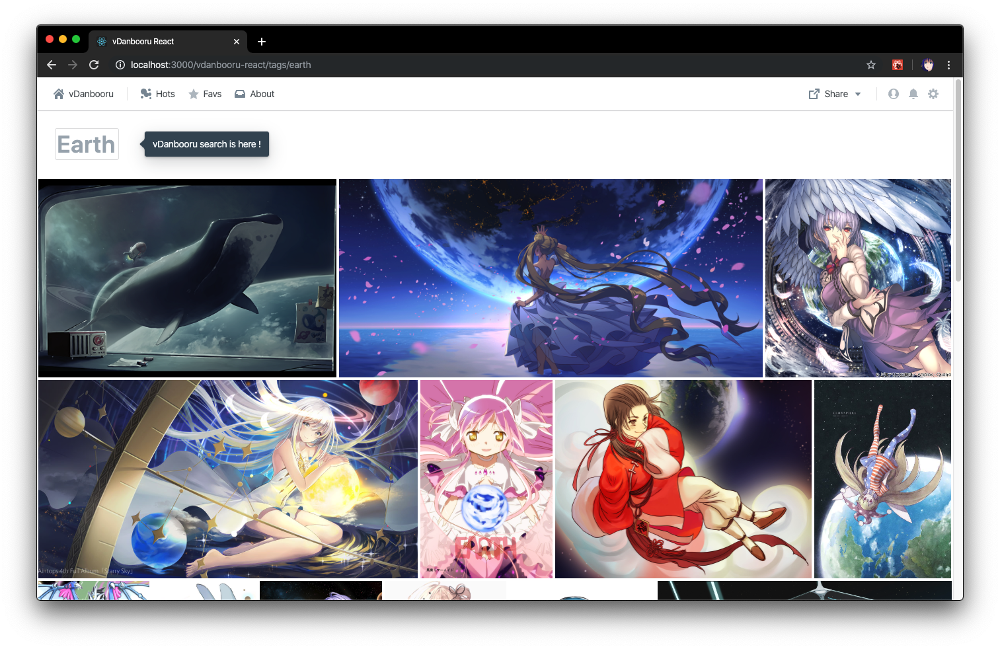
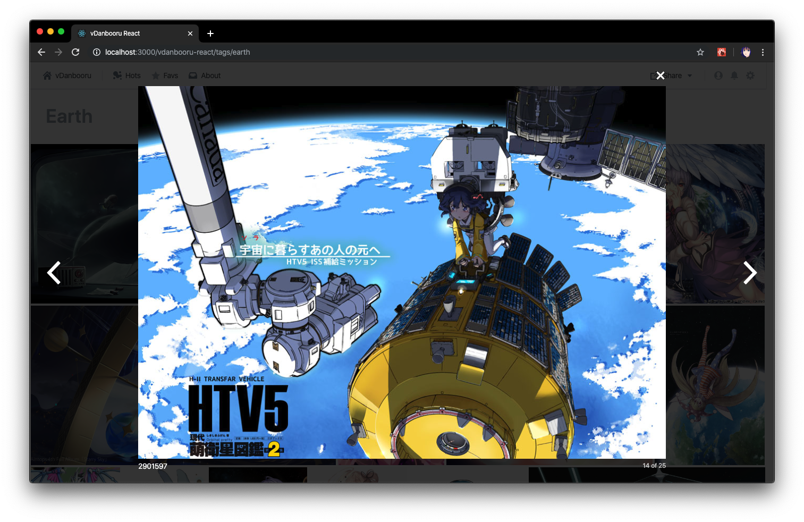
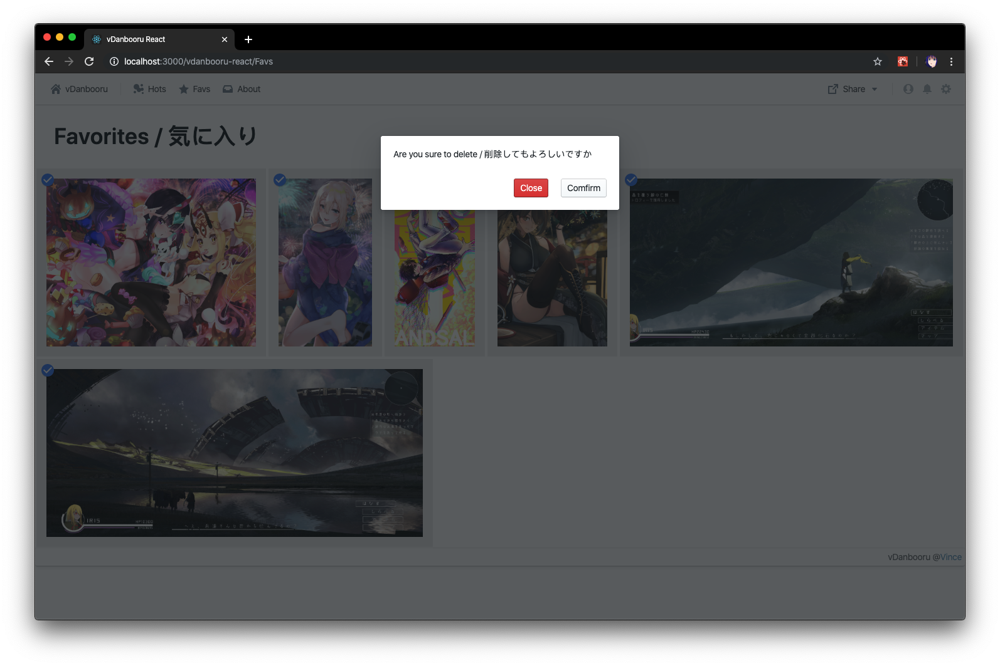
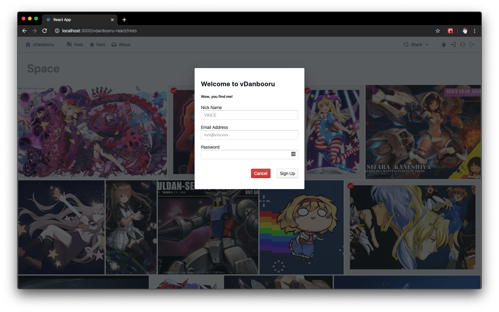

# vDanbooru React App

A React & BlueprintJS implement of vDanbooru, using for searching Image from safe danbooru lib.

[vDanbooru React Portal](http://vince-amazing.us-west-1.elasticbeanstalk.com/vdanbooru-react)

### Update Logs
_10/31/2019_
- Add Redux Data Store
- Add favorite tab features for easy bookmark
- Support new user to signup and login
- Add connection to [Firebase](https://firebase.google.com/) authenticate and Firestore database
- Now favorite images will be linked to your account
- Fix bugs on both moblie and desktop

_10/30/2019_
- Add progress bar and non-ideal state
- Optimized for moblie devices
- Add share to soical features, with [react-share](https://www.npmjs.com/package/react-share)

_10/27/2019_
- Init project with React & [BlueprintJS](https://blueprintjs.com/), ~~deployed with [ZEIT Now](zeit.co) and zero configuration~~
- Connect with api with backend Express with [booru](https://www.npmjs.com/package/booru), ~~[danbooru-node](https://www.npmjs.com/package/danbooru)~~
- Implement index, hot search page, with [react-grid-gallery](https://www.npmjs.com/package/react-grid-gallery)
